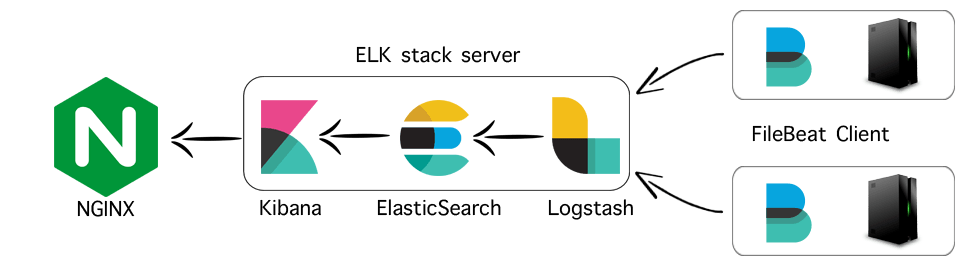

# Kubernetes ELK

> Helm Charts and deployment tools for quickly and easily deploying ELK stacks
in Kubernetes.

## Contents

*   [Overview](#overview)
*   [Deploy](#deploy)
  - [Deploy Local ELK Cluster](#deploy-local-elk-cluster)
*   [Important Notes](#important-notes)

## Overview

The ELK stack allows you to collect, filter, format, and view logs from all of
the applications in your cluster(s).


The full ELK stack consists of the following components:
* **Filebeat** - In each cluster that you want to collect logs from, you deploy a
Daemonset of Filebeat pods that watch the applications' logs and send
them to Logstash.
* **Logstash** - Accepts logs from various input sources including Filebeat,
parses and formats them into JSON, optionally adds other fields, and sends
them on to Elasticsearch.
* **Elasticsearch**: Stores the logs in indices for easy searching.
  - **Elasticsearch Curator** - Periodically removes old indices from Elasticsearch
  to keep disk space in check.
  - **Elastalert**: Watches events/logs coming into Elasticsearch and sends
  alerts to email, Slack, etc.
* **Kibana**: Kibana is your UI for Elasticsearch. You can search through all
of the logs in Kibana.

_All of these components are configurable through Helm charts in this repo._


## Deploy

To deploy any of the charts in this repo you first need to read their README and
default `values.yaml` files. Then create a values file
for the chart you want to deploy. To deploy you can either run the Helm commands
manually or you can use the convenience script `elk.sh` for fast deployment and
teardown. _See `elk.sh` for args valid args._


#### Deploy Local ELK Cluster

1. (Only needs to be done once) Use the `bin/helm-init-namespace.sh` script to
create a `monitor` namespace and initialize Helm (Tiller) in it:

    ```
    bin/helm-init-namespace.sh docker-for-desktop monitor 2.9.0
    ```

2. Deploy the ELK stack. Don't forget to deploy Filebeat also to actually
gather the logs:

    ```
    VALUES=bin/examples/local-elk/local-elasticsearch-values.yaml ./elk.sh docker-for-desktop monitor elasticsearch install
    VALUES=bin/examples/local-elk/local-kibana-values.yaml ./elk.sh docker-for-desktop monitor kibana install
    VALUES=bin/examples/local-elk/local-logstash-values.yaml ./elk.sh docker-for-desktop monitor logstash install

    VALUES=filebeat/environments/local.yaml ./elk.sh docker-for-desktop monitor filebeat install

    kubectl --context=docker-for-desktop -n monitor get pods
    ```

3. **When all the ELK pods are ready** (Kibana may take a few minutes - check it's logs),
port-forward the Kibana pod port 5601 to your localhost:

    ```
    kubectl --context=docker-for-desktop -n monitor port-forward $(kubectl --context=docker-for-desktop -n monitor get pods | grep kibana | awk '{ print $1 }') 5601:5601
    ```

4. (Optional) To improve Elasticsearch performance, define index templates that
will be used to index documents that come into Elasticsearch:

    ```
    # First port forward the http port of the Elasticsearch instance
    kubectl --context=docker-for-desktop -n monitor port-forward $(kubectl --context=docker-for-desktop -n monitor get pods | grep elasticsearch-data | awk '{ print $1 }') 9200:9200

    # Then POST the index templates
    bin/examples/elasticsearch-index-templates/post-es-index-mappings.sh 0.0.0.0:9200
    ```

5. Add the Index Patterns you will search for using the
[Management > Kibana > Index Patterns > Create Index Pattern](http://0.0.0.0:5601/app/kibana#/management/kibana/index) page.

6. Finally, go to the [Discover](http://0.0.0.0:5601/app/kibana#/discover) tab
and search away!

7. When you're ready to tear it all down:

    ```
    ./elk.sh docker-for-desktop monitor elasticsearch delete
    ./elk.sh docker-for-desktop monitor kibana delete
    ./elk.sh docker-for-desktop monitor logstash delete
    ./elk.sh docker-for-desktop monitor filebeat delete
    ```


#### Example of Live Prod ELK Deployment

Below is an example of a simple installation, upgrade, and deletion of a new
ELK stack.

```
export HELM_VERSION=2.9.0
VALUES=prod-elk-elasticsearch-values.yaml ./elk.sh prod-elk monitor elasticsearch install
VALUES=prod-elk-elastalert-values.yaml ./elk.sh prod-elk monitor elastalert install
VALUES=prod-elk-kibana-values.yaml ./elk.sh prod-elk monitor kibana install
VALUES=prod-elk-logstash-values.yaml ./elk.sh prod-elk monitor logstash install

# Oops, need to make an update to the Logstash config!
VALUES=prod-elk-logstash-values.yaml ./elk.sh prod-elk monitor logstash upgrade

# An example of tearing one of the components down:
# NOTE: you'll have to remove PVCs (the persisted data) manually for any charts
# you use persistence on
./elk.sh prod-elk monitor kibana delete
```

#### Ingress to ELK Components

You will need to setup Ingress Controllers that the ELK components' Ingress
resources can use if you enable ingress on the different components. There is
an example in the `bin/` folder.

#### Deploy Filebeat

See `filebeat/` chart [README](filebeat/README.md).


## Important Notes

#### Dedicated Nodes for ELK Components

In production, you should spread ELK components across multiple nodes across
multiple Availability Zones so that you have a Highly Available cluster. For
example you should dedicate a node for each Elasticsearch Data replica, a node
for each Elasticsearch Master replica, Logstash across nodes in different AZs, etc.
Use Kubernetes node taints and labels to accomplish this. See the current
`prod-elk` vpc, and corresponding Helm values for examples of how to do this.

#### Using Elasticsearch Index Templates

Index templates allow you to define templates that will automatically be applied
when new indices are created. See https://www.elastic.co/guide/en/elasticsearch/reference/current/indices-templates.html.
See examples in `bin/examples/elasticsearch-index-templates`.


#### Logstash Notes

Before doing anything with Logstash read these:
- [Grok Can Kill Logstash Performance](https://medium.com/@momchil.dev/killing-your-logstash-performance-with-grok-f5f23ae47956)
- [Pitfalls](https://logz.io/blog/5-logstash-pitfalls-and-how-to-avoid-them/)
